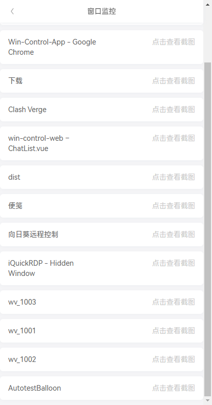

# Mobile Remote PC Control

这是一个基于Node.js的服务端和移动端H5应用，实现手机对电脑的快捷键控制和鼠标操作的工具。界面简洁美观，功能强大，操作便捷，适用于需要移动控制电脑场景。


## 功能:
- 远程控制: 自定义快捷功能，手机web远程控制电脑
- 键盘控制: 文本输入、快捷键操作
- 鼠标操作: 实现鼠标移动、点击、拖拽等基本操作
- 事件配置：自动化操作，允许自定义一组鼠标-键盘-控制逻辑，实现自动化操作
- 窗口：查看应用窗口的截图
- 文件传输: 手机文件快速传输至电脑


### 移动端界面

### 鼠标控制界面

### 创建自动化操作




### 移动端仓库
[ mobile-pc-control-web 仓库](https://github.com/smilexizheng/mobile-pc-control-web).
- 将移动端web项目`build`后的静态资源放到此项目的`out/web`文件中,然后`build:win`, 即可替换移动端网页
- 修改首页菜单方式
```javascript
// 此处定义了客户端 发送和接收的event事件类型 https://github.com/smilexizheng/mobile-pc-control-server/tree/master/src/main/sever/src/constant
// 数据结构如下
[
  {
    categoryName: "快捷指令", modules: [
      {name: "腾讯视频", color: "#2196F3", events:[ {event: CE.OPEN_URL, eventData: {url: "https://v.qq.com/"}}]},
      // 支持自定义一组指令，delay 设置指令执行间隔时间，单位毫秒
      {name: "视频全屏", color: "#2196F3", events:[
          {event: CE.SYS_POINTER_MOVE, eventData: {x: 1230, y: 850}},
          {event: CE.SYS_POINTER_MOVE, eventData: {x: 1438, y: 966},delay:10},
          {event: CE.SYS_MOUSE_CLICK, eventData: {button: 0, double: false},delay:20}
        ]},
      {name: "ESC", color: "#FF5722", events:[ {event: CE.KEYPRESS, eventData: {key: [Key.Escape]}}]},
      {name: "音乐上一首", color: "#4CAF50", events:[ {event: CE.KEYPRESS, eventData: {key: [Key.LeftControl,Key.LeftAlt,Key.Left]}}]},
      {name: "B站", color: "#4CAF50", events:[ {event: CE.OPEN_URL, eventData: {url: "https://www.bilibili.com/"}}]},
    ]
  },
  {
    categoryName: "系统", modules: [
      {name: "回桌面", color: "#4CAF50", events:[ {event: CE.KEYPRESS, eventData: {key: [Key.LeftWin,Key.D] }}]},
      {name: "复制", color: "#2196F3", events:[ {event: CE.KEYPRESS, eventData: {key: [Key.LeftControl, Key.C]}}]},
      {name: "粘贴", color: "#2196F3", events:[ {event: CE.KEYPRESS, eventData: {key: [Key.LeftControl, Key.V]}}]},
      {name: "撤回", color: "#FF5722", events:[ {event: CE.KEYPRESS, eventData: {key: [Key.LeftControl, Key.Z]}}]},
      {name: "关机", color: "#FF5722", events:[ {event: CE.SYS_SHUTDOWN}]}],
    // 显示系统音量控制
    showSysVolume: true
  }
  ]
```


## 平台支持：
- Windows
- macOS（待支持）
- Linux (待支持)

## 计划功能
- [ ]服务端PC互控
- [ ]服务端自定义客户端的 快捷指令、以及权限管理
- [ ]增加客户端连接状态监控
- [ ]socket.io 连接鉴权配置
- [ ]pc服务端配置菜单、以及权限的管理
- [ ]重构为TypeScript、方便大家阅读和共享代码

> 欢迎大家提交PR 或者 issue


## Github Star历史
[](https://starchart.cc/smilexizheng/mobile-pc-control-server)

##  运行项目

### Install

```bash
$ npm install
```

### Development

```bash
$ npm run dev
```

### Build

```bash
# For windows
$ npm run build:win

# For macOS
$ npm run build:mac

# For Linux
$ npm run build:linux
```
