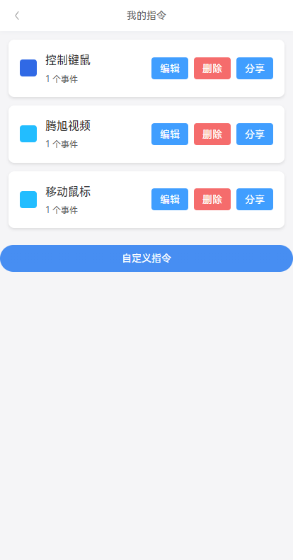
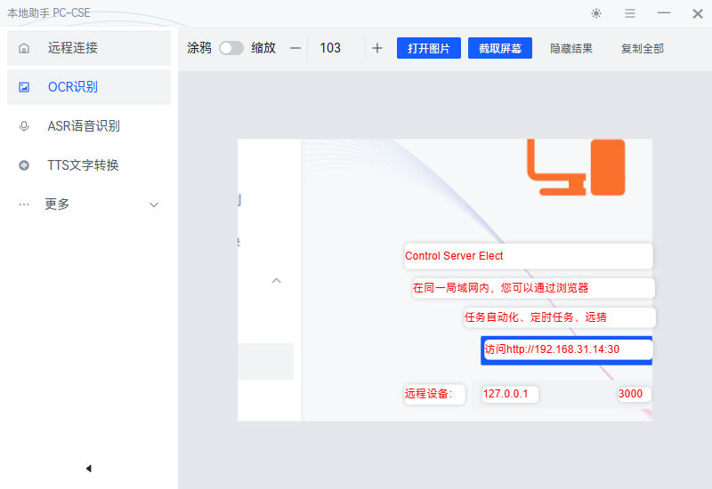
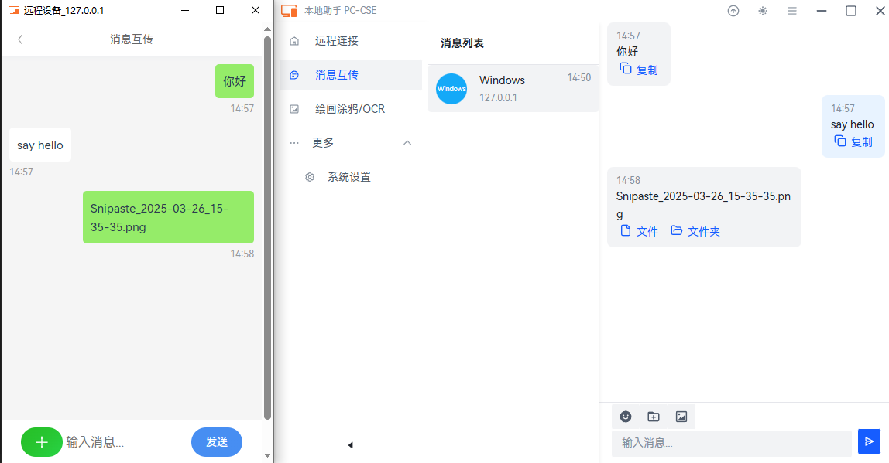

# Mobile Remote PC Control

这是一款基于 Electron 的桌面助手工具，能将你的电脑快速变成可被手机/浏览器远程控制的服务器。主要面向局域网内手机控制电脑的场景，无需互联网，连接方便。


程序在电脑端运行后，会同时启动一个 Express + Socket.IO 服务，并显示二维码。手机扫描二维码即可打开优化过的 H5 网页控制端，实现以下功能


快速了解项目，查看AI分析 [](https://deepwiki.com/smilexizheng/mobile-pc-control-server)
[](https://github.com/smilexizheng/mobile-pc-control-server/stargazers)
[](LICENSE)
<p align="center">中文 | <a href="./docs/README_EN.md">English</a><br></p>

## 核心功能

- 实时远程控制电脑（键盘输入、鼠标移动/点击/拖拽/滚轮,音量调节、关机重启、窗口管理等）
- 屏幕实时流传输（基于 FFmpeg\flv.js ，ios浏览器不支持Meida Source Extensions无法使用，有可能改为hls ）
- 实时聊天 + 在线用户列表+ 双向文件传输
- 自定义快捷指令、组合宏、定时任务（支持 cron）
- 屏幕 OCR 文字识别
- 屏幕涂鸦/标注功能
- 实验性语音功能（语音识别/合成，未启用）

>适合这些场景：沙发上用手机操控客厅电脑、演示时快速切换、家庭自动化触发、手机与电脑间快速传文件、轻量级局域网远程协助等。

## 界面一览

### 移动端预览
<table>
  <tr>
    <td></td>
    <td></td>
    <td><br></td>
  </tr>
  <tr>
    <td></td>
    <td></td>
    <td></td>
  </tr>
</table>

### PC 端预览
#### OCR 识别界面


#### 消息共享界面


## 支持平台
- ✅ Windows（全面测试，推荐首选）
- 🔄 macOS（支持构建，未测试）
- 🔄 Linux（支持构建，未测试）


## 快速上手

### Install

```bash
$ npm install
```

### Development

```bash
$ npm run dev
```

### Build

```bash
# For windows
$ npm run build:win

# For macOS
$ npm run build:mac

# For Linux
$ npm run build:linux
```

### 启动指南

- 运行打包后的应用（exe/app）。
- PC 启动服务器，扫描 二维码或复制链接。
- 手机浏览器扫码/输入 URL，使用 设置的token连接。（默认token: ssss）
- 安全：Token 认证确保连接安全，适合局域网。无内置加密，避免公网使用。

### 常见问题

- Q: 延迟太高？ A: 确认同网段，设置里调整 屏幕质量，或优化网络。
- Q: 手机支持？ A: 主流浏览器（如 Chrome/Safari） 均可。
- Q: 如何扩展？ A: 修改 Vue 组件或新增事件，参考常量文件的event。


### 自定义菜单

-  src/renderer/mobile/views/Home

```javascript
// 此处定义了客户端 发送和接收的event事件类型 https://github.com/smilexizheng/mobile-pc-control-server/tree/master/src/main/sever/src/constant
// 数据结构如下
[
  {
    categoryName: "快捷指令", modules: [
      {name: "腾讯视频", color: "#2196F3", events: [{event: CE.OPEN_URL, eventData: {url: "https://v.qq.com/"}}]},
      // 支持自定义一组指令，delay 设置指令执行间隔时间，单位毫秒
      {
        name: "视频全屏", color: "#2196F3", events: [
          {event: CE.SYS_POINTER_MOVE, eventData: {x: 1230, y: 850}},
          {event: CE.SYS_POINTER_MOVE, eventData: {x: 1438, y: 966}, delay: 10},
          {event: CE.SYS_MOUSE_CLICK, eventData: {button: 0, double: false}, delay: 20}
        ]
      },
      {name: "ESC", color: "#FF5722", events: [{event: CE.KEYPRESS, eventData: {key: [Key.Escape]}}]},
      {
        name: "音乐上一首",
        color: "#4CAF50",
        events: [{event: CE.KEYPRESS, eventData: {key: [Key.LeftControl, Key.LeftAlt, Key.Left]}}]
      },
      {name: "B站", color: "#4CAF50", events: [{event: CE.OPEN_URL, eventData: {url: "https://www.bilibili.com/"}}]},
    ]
  },
  {
    categoryName: "系统", modules: [
      {name: "回桌面", color: "#4CAF50", events: [{event: CE.KEYPRESS, eventData: {key: [Key.LeftWin, Key.D]}}]},
      {name: "复制", color: "#2196F3", events: [{event: CE.KEYPRESS, eventData: {key: [Key.LeftControl, Key.C]}}]},
      {name: "粘贴", color: "#2196F3", events: [{event: CE.KEYPRESS, eventData: {key: [Key.LeftControl, Key.V]}}]},
      {name: "撤回", color: "#FF5722", events: [{event: CE.KEYPRESS, eventData: {key: [Key.LeftControl, Key.Z]}}]},
      {name: "关机", color: "#FF5722", events: [{event: CE.SYS_SHUTDOWN}]}],
    // 显示系统音量控制
    showSysVolume: true
  }
]
```

## Github Star历史

[](https://starchart.cc/smilexizheng/mobile-pc-control-server)

