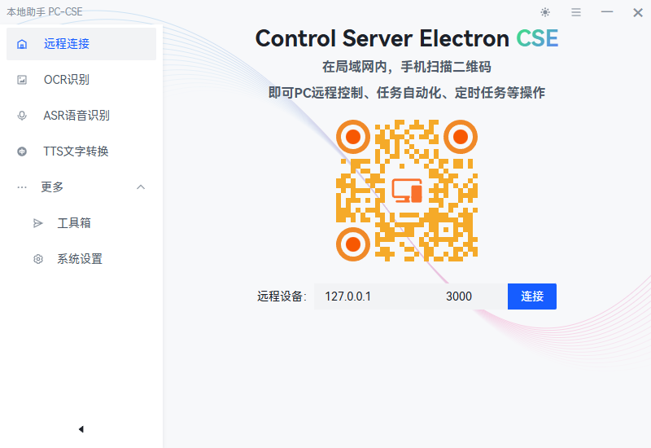
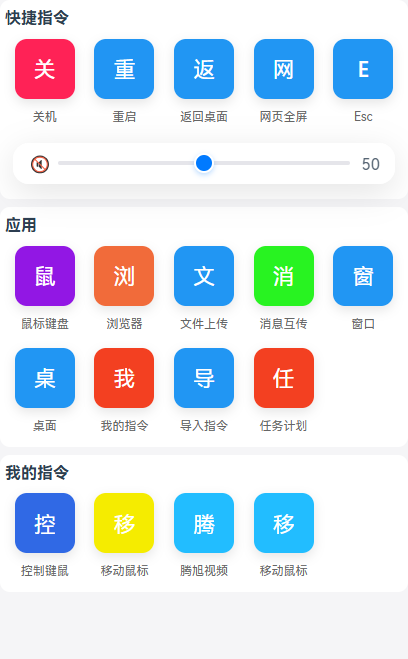
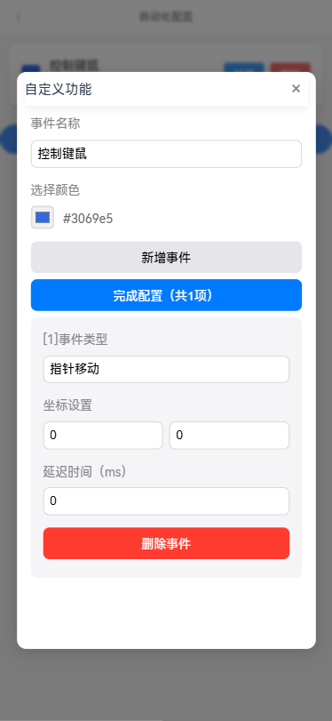

# Mobile Remote PC Control

这是一个基于Node.js的服务端和移动端H5应用，实现手机对电脑的快捷键控制和鼠标操作的工具。界面简洁美观，功能强大，操作便捷，适用于需要移动控制电脑场景。


## 主要功能:
- 键盘控制: 文本输入、快捷键操作
- 鼠标操作: 实现鼠标移动、点击、拖拽等基本操作
- 自动化操作：允许自定义一组鼠标-键盘-控制逻辑，实现自动化操作
- 界面友好: 移动端界面，操作直观




### 移动端界面

### 鼠标控制界面

### 创建自动化操作



## 平台支持：
- Windows
- macOS（待支持）
- Linux (待支持)

## 计划功能
- [ ]服务端PC互控
- [ ]服务端自定义客户端的 快捷指令
- [ ]增加客户端连接状态监控
- [ ]socket.io 连接鉴权配置

> 如有意愿参与开发，欢迎大家提交PR

##  运行项目

### Install

```bash
$ npm install
```

### Development

```bash
$ npm run dev
```

### Build

```bash
# For windows
$ npm run build:win

# For macOS
$ npm run build:mac

# For Linux
$ npm run build:linux
```
