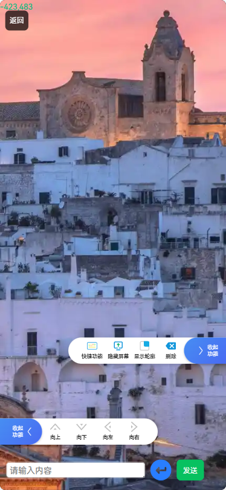
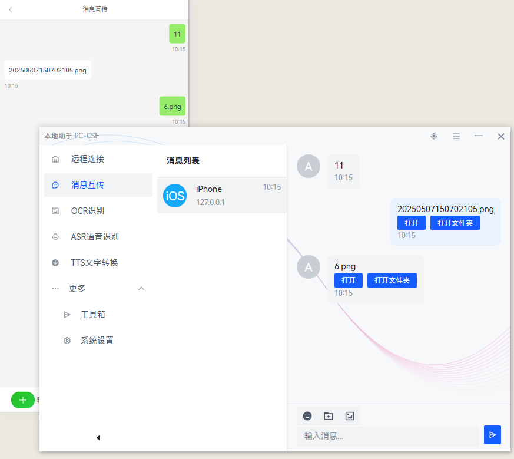

# Mobile Remote PC Control
基于Node.js Electron 的助手应用，核心远程控制电脑\其他辅助性功能，移动端H5界面简洁，适用于常见的手机电脑互通的场景。

欢迎提出issues或者其他想法，哪怕功能本身和这个软件毫无关联。


快速了解项目，查看AI分析 [](https://deepwiki.com/smilexizheng/mobile-pc-control-server)
## 主要功能

### PC 端功能

- **消息互传**：设备之间聊天和文件传输
- **OCR 图文识别**：支持图片文字识别和涂鸦标注
- **语音识别与合成**：基于 sherpa-onnx 的 ASR 语音识别和 TTS 文字转语音 [测试功能]


### 移动端功能
>首页打开为 远控PC操作的功能菜单，除了默认的选项外，可以自定义 （键鼠/快捷键/文本输入/打开网址）等功能菜单
#### 应用解释
- **鼠标键盘**：远程鼠标/键盘功能，支持预览桌面，可以文本输入、快捷键操作、鼠标移动/点击/拖拽
- **消息互传**：聊天和文件传输
- **我的指令**：自定义一组，（键鼠/快捷键/文本输入/打开网址）操作逻辑
- **定时任务**：使用 cron 表达式设置定时触发的动作指令，实现自动化触发功能
- **文件传输**：从移动设备上传文件到电脑
- **窗口截图**：查看电脑运行应用的窗口截图

## 界面预览

### 移动端

<table>
  <tr>
    <td></td>
    <td></td>
    <td>
      </td>
  </tr>
  <tr>
    <td></td>
    <td></td>
    <td></td>
  </tr>
</table>

## PC端
### OCR 图文识别


### 消息互传




## 平台支持

- ✅ Windows
- 🔄 macOS（暂无测试）
- 🔄 Linux（暂无测试）

## 运行项目

### Install

```bash
$ npm install
```

### Development

```bash
$ npm run dev
```

### Build

```bash
# For windows
$ npm run build:win

# For macOS
$ npm run build:mac

# For Linux
$ npm run build:linux
```

### 修改移动端 首页菜单

-  src/renderer/mobile/views/Home

```javascript
// 此处定义了客户端 发送和接收的event事件类型 https://github.com/smilexizheng/mobile-pc-control-server/tree/master/src/main/sever/src/constant
// 数据结构如下
[
  {
    categoryName: "快捷指令", modules: [
      {name: "腾讯视频", color: "#2196F3", events: [{event: CE.OPEN_URL, eventData: {url: "https://v.qq.com/"}}]},
      // 支持自定义一组指令，delay 设置指令执行间隔时间，单位毫秒
      {
        name: "视频全屏", color: "#2196F3", events: [
          {event: CE.SYS_POINTER_MOVE, eventData: {x: 1230, y: 850}},
          {event: CE.SYS_POINTER_MOVE, eventData: {x: 1438, y: 966}, delay: 10},
          {event: CE.SYS_MOUSE_CLICK, eventData: {button: 0, double: false}, delay: 20}
        ]
      },
      {name: "ESC", color: "#FF5722", events: [{event: CE.KEYPRESS, eventData: {key: [Key.Escape]}}]},
      {
        name: "音乐上一首",
        color: "#4CAF50",
        events: [{event: CE.KEYPRESS, eventData: {key: [Key.LeftControl, Key.LeftAlt, Key.Left]}}]
      },
      {name: "B站", color: "#4CAF50", events: [{event: CE.OPEN_URL, eventData: {url: "https://www.bilibili.com/"}}]},
    ]
  },
  {
    categoryName: "系统", modules: [
      {name: "回桌面", color: "#4CAF50", events: [{event: CE.KEYPRESS, eventData: {key: [Key.LeftWin, Key.D]}}]},
      {name: "复制", color: "#2196F3", events: [{event: CE.KEYPRESS, eventData: {key: [Key.LeftControl, Key.C]}}]},
      {name: "粘贴", color: "#2196F3", events: [{event: CE.KEYPRESS, eventData: {key: [Key.LeftControl, Key.V]}}]},
      {name: "撤回", color: "#FF5722", events: [{event: CE.KEYPRESS, eventData: {key: [Key.LeftControl, Key.Z]}}]},
      {name: "关机", color: "#FF5722", events: [{event: CE.SYS_SHUTDOWN}]}],
    // 显示系统音量控制
    showSysVolume: true
  }
]
```

## Github Star历史

[](https://starchart.cc/smilexizheng/mobile-pc-control-server)

